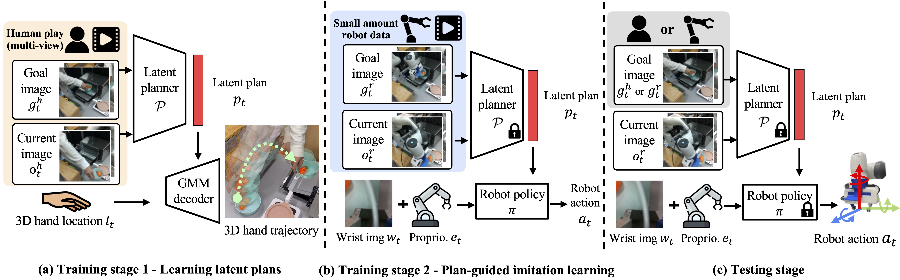

# MimicPlay


-------
## Table of Content
- [Overview](#overview)
- [Installation](#installation)
- [Dataset](#dataset)
- [Training](#training)
- [Baseline Training](#baseline-training)
- [Evaluation](#evaluation)
- [Trained Checkpoints](#trained-checkpoints)
- [Human Play Data Processing](#human-play-data-processing)
- [Acknowledgement](#acknowledgement)
- [Citations](#citations)
- [License](#license)

-------
## Overview

This repository is the implementation code of the CoRL 2023 Oral paper "MimicPlay: Long-Horizon Imitation Learning by Watching Human Play"([arXiv](https://arxiv.org/abs/2302.12422), [Project](https://mimic-play.github.io), [Video](https://arxiv.org/abs/2302.12422)) by Wang et al. at [Nvidia Research](https://www.nvidia.com/en-us/research/) and [Stanford Vision and Learning Lab](http://svl.stanford.edu/).



In this repo, we provide our full implementation code of [training](#training) and [evaluation](#evaluation) in simulation and the [scripts to generate human play dataset](#human-play-data-processing) for experiments in the real-world. Note that, in our main paper, we leverage human play data. However, in simulation, there is no way to get such dataset, which will always end up be robot teleoperation. So in this repo, when training the high-level latent planner, we use the same robot play dataset to train both high-level planner and low-level policy, and reproduce the advantage of MimicPlay(0-human) over baselines in simulation. For real-world experiments, we provide the [process scripts for human play video](#human-play-data-processing), which generates the dataset that can directly used for training the high-level latent planner of this repo.

-------
## Installation
Create and activate conda environment
```	
conda create -n mimicplay python=3.8
conda activate mimicplay
```

The simulation result of MimicPlay is tested on [LIBERO](https://github.com/Lifelong-Robot-Learning/LIBERO), which is a great multitask manipulation simulation based on [robosuite](https://github.com/ARISE-Initiative/robosuite) and latest [MuJoCo](https://github.com/google-deepmind/mujoco). We choose LIBERO due to its utilization of the [BDDL language](https://github.com/StanfordVL/bddl) for goal specification, which facilitates the multitask evaluation for learning from play data.
```	
# Install MuJoCo
pip install mujoco

# Install robosuite
git clone https://github.com/ARISE-Initiative/robosuite.git
cd robosuite
git checkout v1.4.1_libero
pip install -r requirements.txt
pip install -r requirements-extra.txt
pip install -e .

# Install BDDL
cd ..
git clone https://github.com/StanfordVL/bddl.git
cd bddl
pip install -e .

# Install LIBERO
cd ..
git clone https://github.com/Lifelong-Robot-Learning/LIBERO.git
cd LIBERO
pip install -r requirements.txt
pip install -e .
```

MimicPlay is based on [robomimic](https://github.com/ARISE-Initiative/robomimic), which facilitates the basics of learning from offline demonstrations.
```	
cd ..
git clone https://github.com/ARISE-Initiative/robomimic
cd robomimic
git checkout mimicplay-libero
pip install -e .
```

Install MimicPlay
```	
cd ..
git clone https://github.com/j96w/MimicPlay-dev.git
cd MimicPlay-dev
pip install -r requirements.txt
pip install -e .
```

-------
## Dataset
You can download the collected play data (for training) and task video prompts (for multitask evaluation) form [Link](https://drive.google.com/drive/folders/1FUKd3vr-KBiYRnKIymNmGClmVx9U45XG?usp=sharing). The play data is a set of demonstrations without a specific task goal (unlabeled). We recommend downloading the raw data (demo.hdf5) and process it to the training dataset with image observation (demo_image.hdf5) on local machine, since it is a good way to check whether the environment libraries are installed correctly. To process the raw data to the dataset with visual observation, please follow the steps:
- Download and re-locate the dataset
```	
mv mimicplay_release_dataset your_installation_path/mimicplay/datasets
```
- Transform raw data to image dataset
```	
cd MimicPlay-dev/mimicplay
python scripts/dataset_states_to_obs.py --dataset 'datasets/playdata/demo.hdf5' --done_mode 0 --camera_names agentview robot0_eye_in_hand --camera_height 84 --camera_width 84 --output_name image_demo_local.hdf5 --exclude-next-obs
```
- Extract end-effector trajectory for the training of high-level planner
```
python scripts/dataset_extract_traj_plans.py --dataset 'datasets/playdata/image_demo_local.hdf5'
```
- To double-check the generated data, we can save a video by replaying the images from the processed dataset
```	
python scripts/playback_robomimic_dataset.py --dataset 'datasets/playdata/image_demo_local.hdf5' --use-obs --render_image_names agentview_image --video_path image_demo_local_replay.mp4
```
We also provide scripts for collecting your own play data or task video prompts. The steps are:
- Start data collection with a bddl file. For play data, the bddl file does not have an achievable goal (no goal label). (We recommend using a spacemouse for data collection. Keyboard is also supported but might be hard to use.)
```	
python scripts/collect_playdata.py --bddl-file 'scripts/bddl_files/KITCHEN_SCENE9_playdata.bddl'
```
- The collected raw data could be find at `robosuite/robosuite/models/assets/demonstrations/`. To convert the raw data into robomimic format, simply
```
python scripts/convert_playdata_to_robomimic_dataset.py --dataset 'path_to_your_data'
```
- Now you have a raw data in robomimic dataset format. The later steps are introduced at the beginning of this section. You can use same way to generate task-specific video prompts for evaluating the policy learned with play data in multiple tasks.

-------
## Training
MimicPlay is a hirarical arigorithm for learning from play data (no-cut, unlabeled demonstrations), which consists two training stage - (1). Learning goal-conditioned high-level latent planner. (2). Learning plan-guided low-level robot controller.
- Train high-level latent planner
```	
cd MimicPlay-dev/mimicplay
python scripts/train.py --config configs/highlevel.json --dataset 'datasets/playdata/image_demo_local.hdf5'
```
After training, choose the saved checkpoint with the highest evaluation score, use its path as the config of `algo/lowlevel/trained_highlevel_planner` in `configs/lowlevel.json`.
- Train plan-guided low-level robot controller
```	
python scripts/train.py --config configs/lowlevel.json --dataset 'datasets/playdata/image_demo_local.hdf5' --bddl_file 'scripts/bddl_files/KITCHEN_SCENE9_eval-task-1_turn_on_stove_put_pan_on_stove_put_bowl_on_shelf.bddl' --video_prompt 'datasets/eval-task-1_turn_on_stove_put_pan_on_stove_put_bowl_on_shelf/image_demo.hdf5'
```
 The default evaluation task during training is `KITCHEN_SCENE9_eval-task-1_turn_on_stove_put_pan_on_stove_put_bowl_on_shelf.bddl`. Feel free to change it to other evaluation task. After training, we test the learned policy model in multiple long-horiozn tasks as is introduced in [Evaluation](#evaluation).

-------
## Baseline Training
To run a BC-transformer baseline with the same model size and archtecture. Simply
```	
python scripts/train.py --config configs/BC_trans_scratch.json --dataset 'datasets/playdata/image_demo_local.hdf5' --bddl_file 'scripts/bddl_files/KITCHEN_SCENE9_eval-task-1_turn_on_stove_put_pan_on_stove_put_bowl_on_shelf.bddl' --video_prompt 'datasets/eval-task-1_turn_on_stove_put_pan_on_stove_put_bowl_on_shelf/image_demo.hdf5'
```
The only difference between this baseline and MimicPlay is it does not have a high-level latent planner and train an end-to-end low-level controller directly with goal image inputs (Same as Play-LMP).

To run a BC-RNN-GMM baseline (robomimic) with play data. Simply
```	
python scripts/train.py --config configs/BC_RNN_scratch.json --dataset 'datasets/playdata/image_demo_local.hdf5' --bddl_file 'scripts/bddl_files/KITCHEN_SCENE9_eval-task-1_turn_on_stove_put_pan_on_stove_put_bowl_on_shelf.bddl' --video_prompt 'datasets/eval-task-1_turn_on_stove_put_pan_on_stove_put_bowl_on_shelf/image_demo.hdf5'
```


-------
## Evaluation
Evaluation on all tasks (link the testing policy model in `run_trained_agent_multitask.sh`):
```
./scripts/run_trained_agent_multitask.sh
```
To evaluate on a specific task, simply
```
python scripts/run_trained_agent.py --agent 'path_to_trained_low-level_policy' --bddl_file 'path_to_task_bddl_file' --video_prompt 'path_to_task_video_prompt' --video_path 'eval_rollouts.mp4'
```
For example, you can use `scripts/bddl_files/KITCHEN_SCENE9_eval-task-1_turn_on_stove_put_pan_on_stove_put_bowl_on_shelf.bddl` and `datasets/eval-task-1_turn_on_stove_put_pan_on_stove_put_bowl_on_shelf/image_demo.hdf5` as the `bddl_file` and `video_prompt`.

-------
## Trained Checkpoints
You can download our trained checkpoints from [Link](https://drive.google.com/drive/folders/12d33vJKKi6IbECf5wcFfhCGjCzBojTvU?usp=sharing). The comparsion results between MimicPlay(0-human) and baselines in simulation could be found in our paper appendix.

-------
## Human play data processing
In the real world experiments, MimicPlay leverages human play data. The following example will guide you to generate a hdf5 dataset file from two MP4 video files (dual camera views for 3D hand trajectory). The steps are:
- We use the open-sourced [hand_object_detector](https://github.com/ddshan/hand_object_detector) to detect hand in the video. Setup the environment for the detector through
```
conda create --name handobj python=3.6
conda activate handobj
conda install pytorch=1.0.1 torchvision cudatoolkit=10.0 -c pytorch
cd mimicplay/scripts/human_playdata_process
git clone https://github.com/ddshan/hand_object_detector && cd hand_object_detector
pip install -r requirements.txt
cd lib
python setup.py build develop
```
- After building the detector, download the [faster_rcnn model](https://drive.google.com/file/d/1H2tWsZkS7tDF8q1-jdjx6V9XrK25EDbE/view) and place the model through
```
cd hand_object_detector
mkdir -p models/res101_handobj_100K/pascal_voc
mv faster_rcnn_1_8_132028.pth models/res101_handobj_100K/pascal_voc/.
```
- Then, bring mimicplay script into the detector repo
```
cd mimicplay/scripts/human_playdata_process/
cp demo_mp4.py hand_object_detector/
```
- Also copy two example videos (vis_1.mp4 and vis_2.mp4)
```
cp vis_1.mp4 hand_object_detector/
cp vis_2.mp4 hand_object_detector/
```
- Finally
```
cd hand_object_detector/
python demo_mp4.py
```
- If you find an error about undefined symbol, simply
```
pip install torch==1.3.0
cd hand_object_detector/lib/
rm -rf build
python setup.py build develop
```
- Then rerun the processing script
```
cd hand_object_detector/
python demo_mp4.py
```
- After waiting you will see a hdf5 dataset file. To visualize the generated dataset, simply
```
cd scripts/human_playdata_process/
python vis_processed_human_play_data.py
```

-------
## Acknowledgement
- Our environment is based on [LIBERO](https://github.com/Lifelong-Robot-Learning/LIBERO), [robosuite](https://github.com/ARISE-Initiative/robosuite), and [BEHAVIOR BDDL language](https://github.com/StanfordVL/bddl).
- Our training and evaluation scripts are based on [robomimic](https://github.com/ARISE-Initiative/robomimic).
- Our human hand detection is based on [hand_object_detector](https://github.com/ddshan/hand_object_detector).

-------
## Citations
Please cite [MimicPlay](https://mimic-play.github.io/) if you find this repository helpful:
```
@article{wang2023mimicplay,
  title={Mimicplay: Long-horizon imitation learning by watching human play},
  author={Wang, Chen and Fan, Linxi and Sun, Jiankai and Zhang, Ruohan and Fei-Fei, Li and Xu, Danfei and Zhu, Yuke and Anandkumar, Anima},
  journal={arXiv preprint arXiv:2302.12422},
  year={2023}
}
```

-------
## License
Licensed under the [MIT License](LICENSE)